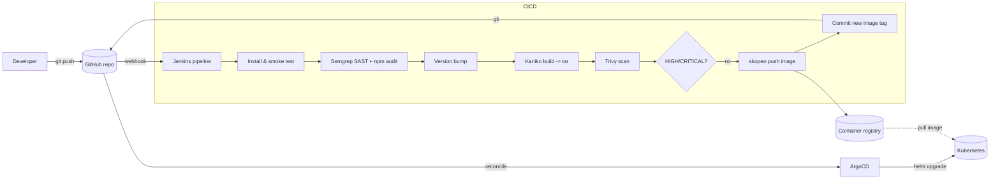

# DevOps / DevSecOps Challenge — Node.js on Kubernetes

Submission for the DevOps/DevSecOps take-home challenge. It vendors the sample
app from [EladAviczer/sample-nodejs](https://github.com/EladAviczer/sample-nodejs),
containerizes it, deploys it to Kubernetes with a Helm chart, and drives the
whole lifecycle through a Jenkins CI/CD pipeline with DevSecOps gates and GitOps
delivery via ArgoCD.

## Repository structure

| Path | Purpose |
| --- | --- |
| `app/` | Vendored Node.js application, `Dockerfile`, and smoke test |
| `charts/sample-nodejs/` | Helm chart used to deploy the app |
| `Jenkinsfile` | Jenkins CI/CD pipeline (test, scan, build, push, promote) |
| `argocd/` | ArgoCD `AppProject` + `Application` manifests (GitOps) |
| `docs/` | Task brief |

## The application

A lightweight Express.js service listening on port `8080` (override with `PORT`).

| Route | Purpose |
| --- | --- |
| `/my-app` | Main page (`Hello, World!`), increments a Prometheus counter |
| `/about` | Static info |
| `/ready` | Readiness probe endpoint |
| `/live` | Liveness probe endpoint |
| `/classified` | Demo endpoint |
| `/metrics` | Prometheus metrics |

Dependencies: `express`, `prom-client`.

## Architecture & CI/CD flow



The pipeline **builds, then scans, then pushes** — a vulnerable image never
reaches the registry. Deployment is fully GitOps: CI only commits a new image
tag; ArgoCD is the sole component that talks to the cluster.

## Key decisions & justifications

### Workload type — `Deployment` (not `StatefulSet`)
The app is **stateless**: no persistent volumes, no stable network identity, no
ordering requirements. Its only "state" (the Prometheus counter) is in-memory
and scrape-based. A `Deployment` gives cheap horizontal scaling, rolling
updates, and easy self-healing. A `StatefulSet` would add stable identities and
ordered, serial rollouts we simply don't need. The chart also ships an optional
`HorizontalPodAutoscaler`, which pairs naturally with a `Deployment`.

### CI/CD — Jenkins on Kubernetes
A declarative `Jenkinsfile` runs on **ephemeral Kubernetes pod agents**, one
container per tool (node, semgrep, kaniko, trivy, skopeo, git). Benefits: clean,
reproducible, isolated build environments with no tools installed on a static
agent, and it mirrors the target runtime (Kubernetes).

### Image build — Kaniko + skopeo (no Docker daemon)
Kaniko builds images **rootless, without a Docker daemon**, which is the right
fit inside a Kubernetes pod. Crucially, Kaniko builds to a **local tarball**
(`--no-push`); Trivy scans that tarball; only if it passes does **skopeo** push
it. This ordering is what enforces "block deployment on high-severity findings"
— the artifact is gated *before* it is published.

### GitOps — ArgoCD pulling from the app repo
Two options were on the table: (a) a separate GitOps repo, or (b) ArgoCD reading
manifests from the app repo. This submission uses **(b)** because:
- It's a single application — one source of truth keeps app code, chart, and the
  deployed version together and atomically reviewable in one history.
- A separate repo adds cross-repo credential/PR overhead that only pays off at
  multi-app / multi-team scale.

Promotion stays declarative: CI commits the new `image.tag` into the chart
values, and ArgoCD (auto-sync + self-heal + prune) reconciles the cluster to
match Git. At larger scale the same pipeline can be pointed at a dedicated
environments repo with almost no change.

## DevSecOps controls

| Control | Tool | Gate |
| --- | --- | --- |
| SAST (code) | Semgrep (OWASP-listed) | Fails build on `ERROR`-severity findings |
| Dependency audit | `npm audit` | Fails build on `critical` vulnerabilities |
| Image vulnerability scan | Trivy | **Blocks push/deploy** on `HIGH`/`CRITICAL` (unfixed excluded) |
| Least-privilege runtime | Helm chart | Non-root (UID 1000), read-only rootfs, drop all caps, seccomp `RuntimeDefault`, SA token automount off |
| Supply chain | Kaniko + skopeo | Build -> scan -> push (scan before publish) |

## How to run

### 1. Build and test the container locally
```bash
cd app
npm ci
npm test                       # smoke test hits /ready /live /my-app /about /metrics
docker build -t sample-nodejs:local .
docker run --rm -p 8080:8080 sample-nodejs:local
curl localhost:8080/my-app     # -> Hello, World!
```

### 2. Deploy with Helm (manual)
```bash
helm lint charts/sample-nodejs
helm upgrade --install sample-nodejs charts/sample-nodejs \
  --namespace sample-nodejs --create-namespace \
  --set image.tag=<tag>
kubectl -n sample-nodejs rollout status deploy/sample-nodejs
```

### 3. Deploy with ArgoCD (GitOps — recommended)
```bash
kubectl apply -f argocd/project.yaml
kubectl apply -f argocd/application.yaml
# ArgoCD creates the namespace and syncs the chart automatically.
argocd app get sample-nodejs
```

### 4. Access the app
The chart provisions an Ingress (class `nginx`) for host `sample-nodejs.local`.
Point that host at your ingress controller (DNS or `/etc/hosts`) and browse:
```
http://sample-nodejs.local/my-app
```
Or without ingress, port-forward:
```bash
kubectl -n sample-nodejs port-forward svc/sample-nodejs 8080:80
curl localhost:8080/my-app
```

### 5. CI/CD (Jenkins) prerequisites
Configure the pipeline job as **Multibranch** / *Pipeline from SCM* pointing at
this repo, with a Kubernetes cloud configured, and these credentials in the
agent namespace / Jenkins:
- `regcred` — a Kubernetes `dockerconfigjson` Secret used to push images.
- `github-credentials` — username + token used for the GitOps promotion commit.

On `main`, a successful run bumps the version, builds, scans, pushes, and commits
the new image tag back — ArgoCD then rolls it out.

## Git workflow

Trunk-based: short-lived feature branches open PRs into `main`. On branches/PRs
the pipeline runs test -> SAST -> build -> scan (no push/deploy). On `main` it
also bumps the patch version, pushes the image, tags the release `vX.Y.Z`, and
promotes via GitOps. The promotion commit carries `[skip ci]` (and the pipeline
guards against it) to avoid build loops.
