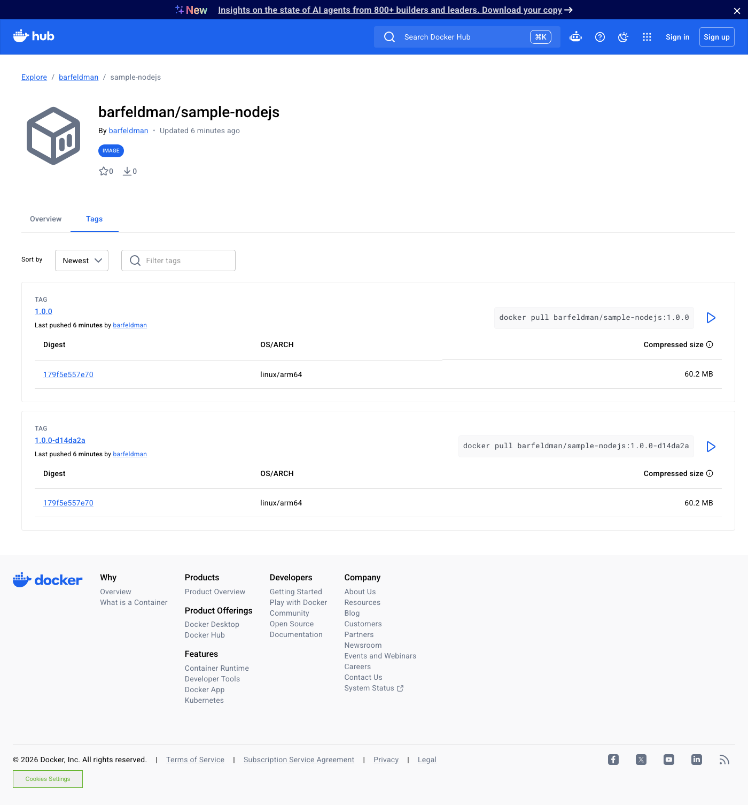
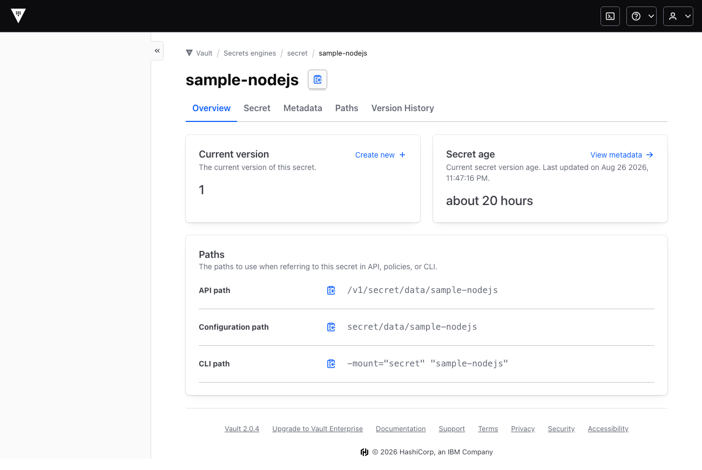

# Sample Node.js app on Kubernetes

This is my write-up for the DevOps/DevSecOps exercise. I forked the sample Node
app from [EladAviczer/sample-nodejs](https://github.com/EladAviczer/sample-nodejs),
containerised it, wrote a Helm chart, and put a Jenkins pipeline in front of it
that builds, tests, scans and ships. Argo CD does the actual deploy straight from
Git.

Everything lives in this one repo:

- `app/` is the Node app, its Dockerfile and a small smoke test
- `charts/sample-nodejs/` is the Helm chart
- `Jenkinsfile` is the pipeline
- `argocd/` holds the Argo CD project and application
- `docs/` has the original task, the architecture diagram and the deploy screenshots

## The app

It's a tiny Express server on port 8080. A few routes and not much else:

| Route | What it returns |
| --- | --- |
| `/my-app` | `Hello, World!` and bumps a Prometheus counter |
| `/about` | a one-line description |
| `/ready` | 200, used for the readiness probe |
| `/live` | 200, used for the liveness probe |
| `/classified` | a throwaway endpoint |
| `/metrics` | Prometheus metrics |

The only dependencies are `express` and `prom-client`. There were no tests in the
original, so I added a smoke test under `app/test/` that boots the server and
checks the main routes actually answer. That runs as the first gate in CI.

## How it fits together


The flow is what you'd expect. You push to GitHub, Jenkins picks it up and runs
through its stages, and if everything passes it pushes the image to Docker Hub
under an immutable version-plus-SHA tag and writes that tag back into the chart
values. Argo CD notices that commit and brings the cluster in line with it.
Traffic reaches the app only through the ingress.

One detail I care about: the pipeline builds the image, scans it, and *then*
pushes. If Trivy finds something serious the image never lands in the registry,
so a bad build can't be deployed by accident. The diagram source is in
`docs/architecture.svg` if you want to tweak it.

## Why I built it this way

**Deployment over StatefulSet.** The app keeps nothing around between requests.
No volumes, no stable hostnames, no leader election, and the only "state" (the
request counter) lives in memory and is scraped by Prometheus anyway. So a plain
Deployment is the honest choice. It gives me rolling updates and easy scaling,
and it lets me bolt on an HPA later without fighting the workload type. A
StatefulSet would buy stable identities and ordered rollouts that this app has no
use for.

**Jenkins running on Kubernetes.** Each stage runs in its own container inside a
throwaway pod (node, git, semgrep, gitleaks, hadolint, helm, kubeconform, kaniko,
trivy, skopeo). I like this because there's nothing to install or keep patched on
a static agent, every build starts clean, and the build environment looks like
where the app actually runs.

**Kaniko plus skopeo instead of Docker.** There's no Docker daemon inside a build
pod, and I didn't want to mount a host socket. Kaniko builds rootless. The catch
is that I want to scan before publishing, so Kaniko writes the image to a local
tarball, Trivy scans that, and only then does skopeo push it. That ordering is
the whole point of "block the deploy on a bad image", and you can't get it if you
build and push in one shot.

While I was at it I checked the tool images by hand, because crane's debug image
has no `/bin/sh` and would have quietly broken the Jenkins `sh` step. skopeo has a
real shell, so that's what I used for the push.

**Argo CD reading from this repo.** The exercise let me choose between a separate
GitOps repo and pointing Argo at the app repo. For a single service I went with
the same repo. The app, the chart and the deployed version all move together in
one history, which is easier to review and reason about. A dedicated environments
repo earns its keep once you've got several apps or teams, and the pipeline would
barely change if I split it out later. Promotion stays declarative either way:
CI just commits a new image tag and Argo does the rest.

## Security

The pipeline treats security as a set of gates, and every one of them fails the
build on a real finding, so nothing broken gets past the stage that catches it.
They run cheapest and earliest first:

| Gate | Tool | What it catches | Fails on |
| --- | --- | --- | --- |
| Secret scan | gitleaks | credentials committed anywhere in git history | any leak |
| Unit / smoke | node | the app doesn't boot or a route regressed | test failure |
| SAST | Semgrep | insecure code patterns | high severity |
| Dependency audit | npm audit | vulnerable npm packages | critical |
| Dockerfile lint | hadolint | Dockerfile foot-guns (root user, floating tags) | any finding |
| Manifest misconfig | Trivy config | insecure Kubernetes settings in the rendered chart | HIGH / CRITICAL |
| Manifest schema | kubeconform | manifests that aren't valid Kubernetes | any invalid doc |
| Image scan | Trivy image | OS and library CVEs in the built image | HIGH / CRITICAL |

A few of these are worth calling out. The **secret scan** runs first and looks at
the whole history, not just the diff, so a key committed five commits ago and
"removed" later still trips it. The **manifest gates** render the chart with
`helm template` and then scan the output: Trivy config flags things like a
container that can run as root or a missing read-only root filesystem, and
kubeconform checks the YAML actually validates against the Kubernetes schemas. So
a bad chart change is caught in CI instead of at `kubectl apply` time. I keep
`--ignore-unfixed` on the image scan so it doesn't wedge on base-image CVEs that
have no patch yet.

I ran the four new gates locally against this repo; the output is in
[`docs/proof/security-scans.txt`](docs/proof/security-scans.txt) and everything
comes back clean. One of them earned its place straight away: Trivy config failed
the Helm test pod for running with a default security context (a HIGH), so I gave
it the same non-root, read-only, drop-all hardening as the app.

At runtime the chart runs the container as non-root (UID 1000), with a read-only
root filesystem (there's a small emptyDir for `/tmp`), all Linux capabilities
dropped, the default seccomp profile on, and the service account token not
mounted since the app never talks to the API server.

## Images and the registry

Built images go to Docker Hub at
[`docker.io/barfeldman/sample-nodejs`](https://hub.docker.com/r/barfeldman/sample-nodejs).
Kaniko builds the image inside the pipeline, Trivy scans the resulting tarball,
and only a clean image is pushed with skopeo.

Every image gets an **immutable tag**: the app version plus the short git SHA,
for example `1.0.0-d14da2a`. I don't deploy moving tags like `latest` or a bare
`1.0.0`, because those can point at different bytes tomorrow and make a rollback
meaningless. The tag names the exact commit it was built from, the pipeline
writes that tag into the chart values as the promotion step, and Argo CD deploys
it. What's running is always traceable back to one line of history.

The proof is in
[`docs/proof/dockerhub-deploy.txt`](docs/proof/dockerhub-deploy.txt): the digest
Docker Hub reports for the pushed tag is byte-for-byte the digest the running
pods report pulling. No local image loading, no `latest`.



## Rolling back

Because the deployed version is just a tag in Git, a rollback is a Git operation,
and that's the primary path:

```bash
git revert <promote-commit>   # put the previous immutable tag back
git push                      # Argo CD reconciles the cluster to it
```

Two things make this safe. The image is immutable, so reverting to the old tag
brings back exactly the bytes that were running before, not a fresh rebuild. And
the rollout is set up so a bad version can't take the app down: with two replicas
the effective `maxUnavailable` is zero, so Kubernetes keeps the healthy pods
serving until a replacement is genuinely ready.

I tested this end to end instead of just describing it. I promoted a deliberately
broken tag (`0.0.0-broken`), let Argo CD apply it, and watched the new pod sit in
`ImagePullBackOff` while the two old pods kept answering 200. Then I reverted the
bad commit, and the cluster was back on the good image about six seconds later.
The full sequence, with pod states and the git trail, is in
[`docs/proof/rollback.txt`](docs/proof/rollback.txt).

If I ever needed to move faster than a Git round-trip during an incident, there
are two lower-level escape hatches: `argocd app rollback sample-nodejs` jumps to a
previous synced revision, and `kubectl -n sample-nodejs rollout undo
deploy/sample-nodejs` reverts the Deployment's ReplicaSet. Both are stop-gaps.
With Argo's self-heal on, the real fix still has to land in Git or Argo will
reconcile the cluster straight back to whatever the repo says.

## Secrets (HashiCorp Vault)

Application secrets come from HashiCorp Vault, not from Git or plaintext
manifests. The flow:

1. The secret lives in Vault's KV v2 store at `secret/sample-nodejs`.
2. The app's ServiceAccount authenticates to Vault with Kubernetes auth; a
   least-privilege policy lets that role read only that one path.
3. The Vault Secrets Operator (VSO) reads it and syncs it into a native
   Kubernetes Secret, which the Deployment consumes via `envFrom`.
4. The app reads `API_TOKEN` and uses it to protect `/classified` (200 with a
   valid `x-api-token`, 401 otherwise). It never logs the value.

VSO re-reads Vault on an interval and restarts the Deployment when the secret
changes, so rotation is a `vault kv put` away. All of this is gated behind
`vault.enabled` in the chart: the Vault path and the auth role live in Git, the
secret value never does. Setup is in
[`vault/configure-vault.sh`](vault/configure-vault.sh) and there's an end-to-end
trace in [`docs/proof/vault-secrets.txt`](docs/proof/vault-secrets.txt). Argo CD
manages the Vault resources alongside the app (`vaultconnection`, `vaultauth` and
`vaultstaticsecret` appear in the resource tree further down), and the secret
itself lives in Vault:



The demo runs a single-node Vault that I initialised and unsealed by hand (the
unseal keys stay in a git-ignored file). For real production I'd add auto-unseal
via a cloud KMS or Transit, TLS, an HA (raft) cluster, audit devices, shorter
token TTLs, and I'd move the CI credentials (registry and Git tokens) into Vault
the same way.

## Running it

Locally, without Kubernetes:

```bash
cd app
npm ci
npm test
docker build -t sample-nodejs:local .
docker run --rm -p 8080:8080 sample-nodejs:local
curl localhost:8080/my-app
```

On a cluster with Helm directly:

```bash
helm upgrade --install sample-nodejs charts/sample-nodejs \
  --namespace sample-nodejs --create-namespace \
  --set image.tag=<tag>
```

Or the GitOps way, which is how it's meant to run:

```bash
kubectl apply -f argocd/project.yaml
kubectl apply -f argocd/application.yaml
```

The chart creates an ingress for `sample-nodejs.local`, so point that name at
your ingress controller and open `http://sample-nodejs.local/my-app`. If you'd
rather skip DNS, just port-forward the service:

```bash
kubectl -n sample-nodejs port-forward svc/sample-nodejs 8080:80
curl localhost:8080/my-app
```

If you want to run the pipeline yourself, the job should be a Multibranch or
"Pipeline from SCM" job with a Kubernetes cloud configured. It needs two things
wired up: a `regcred` docker-config secret with push access to Docker Hub, and a
`github-credentials` username/token for the promotion commit.

## Proof it actually runs

I didn't just template it and call it done. I stood the whole thing up on
minikube and deployed through Argo CD, not with a manual `helm install`. Argo
reported everything synced and healthy, and the app answered 200 on every route
through the nginx ingress. The resource tree below also includes the Vault
resources (`vaultconnection`, `vaultauth`, `vaultstaticsecret`) that feed the app
its secret. The screenshots and a full `kubectl` dump are in
[`docs/proof/`](docs/proof/).

| Argo CD (app + Vault resources) | The app through the ingress |
| --- | --- |
|  |  |

The pipeline itself also runs green on a real Jenkins (Helm-deployed on the same
cluster, with Kubernetes pod agents). The full build console, including the
Semgrep and Trivy output, is in
[`docs/proof/jenkins-build-console.txt`](docs/proof/jenkins-build-console.txt).


## A few honest notes

I ran the pipeline on a real Jenkins to make sure it actually works, not just that
it compiles. Jenkins is Helm-deployed on the same minikube cluster and runs each
stage in its own container on a Kubernetes pod agent. It goes green end to end:
checkout, install and smoke test, Semgrep SAST (0 findings), npm audit (0 vulns),
the Kaniko build, and the Trivy scan (0 HIGH/CRITICAL). The push and GitOps
promote stages only run on `main`, so a branch build skips them as designed. Doing
this shook out two real bugs I'd otherwise have shipped: `timestamps()` needed a
plugin that wasn't installed, and my own git commands tripped git's
dubious-ownership check inside the agent container. Both are fixed.

I added the secret, Dockerfile and manifest gates after that run. By then I'd
taken Jenkins down to free memory for Vault, so rather than re-running the whole
job I validated those four against this repo using the same container images the
pipeline pins (gitleaks, hadolint, Trivy config, kubeconform). The output is in
[`docs/proof/security-scans.txt`](docs/proof/security-scans.txt).

Running the gates directly also caught real vulnerabilities: npm audit flagged
vulnerable Express transitive deps, and Trivy caught npm's bundled packages plus
an OpenSSL CVE in the base image. That is why the lockfile is patched and the
Dockerfile drops npm and runs `apk upgrade`. Everything comes back clean now.

The demo image is pushed to Docker Hub and pulled back down by the cluster, so
the registry round-trip is real and not faked with a local image load. I checked
that the running pods pull the exact digest I pushed, and the deployed tag is the
immutable version-plus-SHA one, never `latest`. The version bump is a simple patch
bump on `main`; the promotion commit carries `[skip ci]` and the pipeline also
guards against it so it can't trigger itself in a loop.
