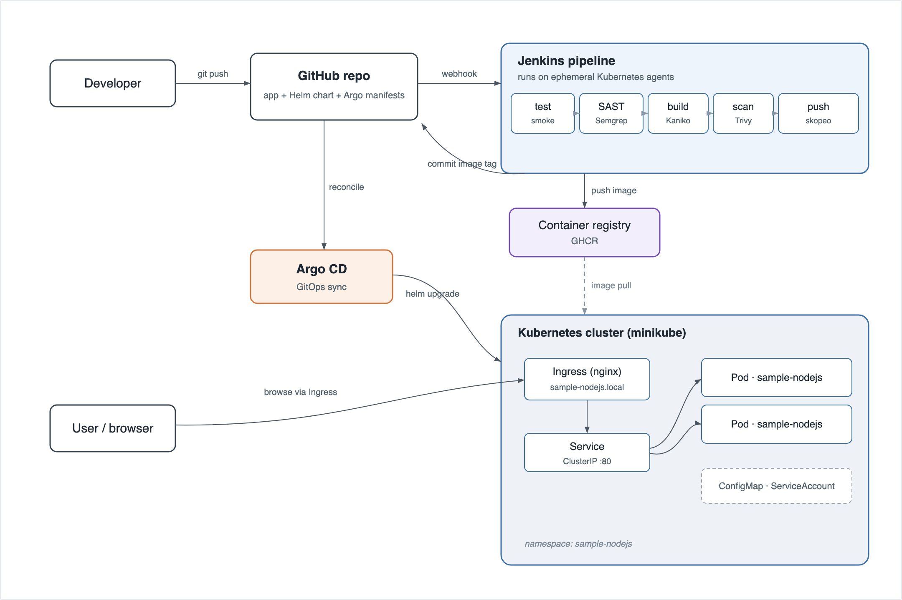
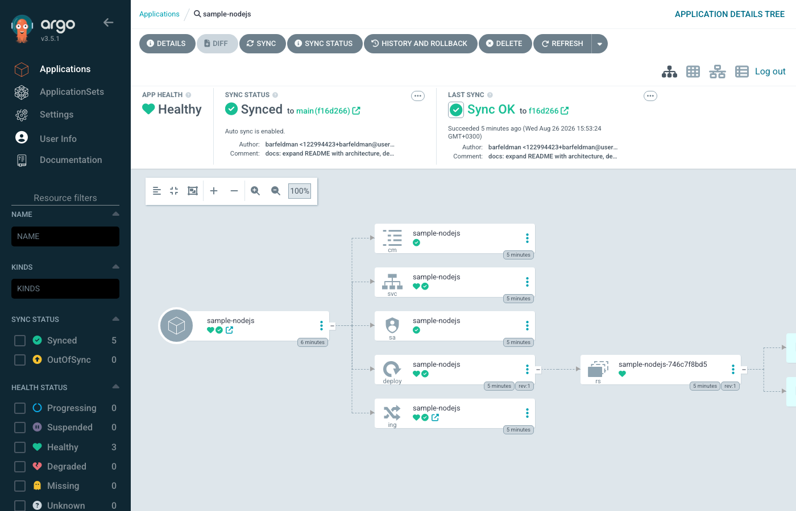
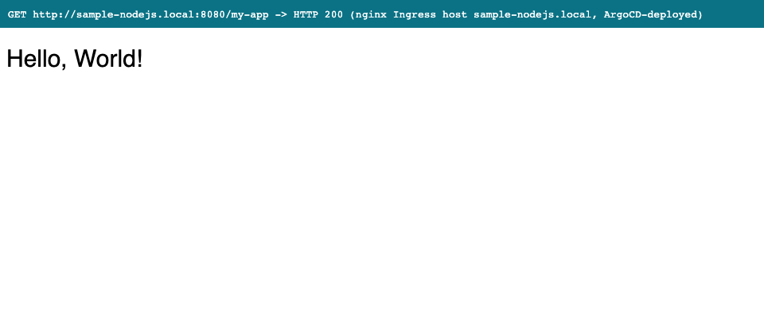
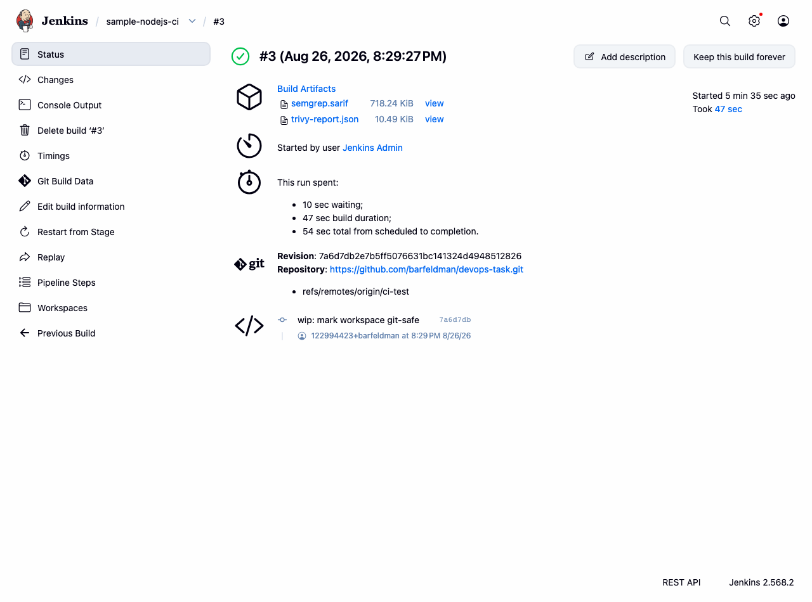

# Sample Node.js app on Kubernetes

This is my write-up for the DevOps/DevSecOps exercise. I forked the sample Node
app from [EladAviczer/sample-nodejs](https://github.com/EladAviczer/sample-nodejs),
containerised it, wrote a Helm chart, and put a Jenkins pipeline in front of it
that builds, tests, scans and ships. Argo CD does the actual deploy straight from
Git.

Everything lives in this one repo:

- `app/` is the Node app, its Dockerfile and a small smoke test
- `charts/sample-nodejs/` is the Helm chart
- `Jenkinsfile` is the pipeline
- `argocd/` holds the Argo CD project and application
- `docs/` has the original task, the architecture diagram and the deploy screenshots

## The app

It's a tiny Express server on port 8080. A few routes and not much else:

| Route | What it returns |
| --- | --- |
| `/my-app` | `Hello, World!` and bumps a Prometheus counter |
| `/about` | a one-line description |
| `/ready` | 200, used for the readiness probe |
| `/live` | 200, used for the liveness probe |
| `/classified` | a throwaway endpoint |
| `/metrics` | Prometheus metrics |

The only dependencies are `express` and `prom-client`. There were no tests in the
original, so I added a smoke test under `app/test/` that boots the server and
checks the main routes actually answer. That runs as the first gate in CI.

## How it fits together



The flow is what you'd expect. You push to GitHub, Jenkins picks it up and runs
through its stages, and if everything passes it pushes the image and writes the
new tag back into the chart values. Argo CD notices that commit and brings the
cluster in line with it. Traffic reaches the app only through the ingress.

One detail I care about: the pipeline builds the image, scans it, and *then*
pushes. If Trivy finds something serious the image never lands in the registry,
so a bad build can't be deployed by accident. The diagram source is in
`docs/architecture.svg` if you want to tweak it.

## Why I built it this way

**Deployment over StatefulSet.** The app keeps nothing around between requests.
No volumes, no stable hostnames, no leader election, and the only "state" (the
request counter) lives in memory and is scraped by Prometheus anyway. So a plain
Deployment is the honest choice. It gives me rolling updates and easy scaling,
and it lets me bolt on an HPA later without fighting the workload type. A
StatefulSet would buy stable identities and ordered rollouts that this app has no
use for.

**Jenkins running on Kubernetes.** Each stage runs in its own container inside a
throwaway pod (node, semgrep, kaniko, trivy, skopeo, git). I like this because
there's nothing to install or keep patched on a static agent, every build starts
clean, and the build environment looks like where the app actually runs.

**Kaniko plus skopeo instead of Docker.** There's no Docker daemon inside a build
pod, and I didn't want to mount a host socket. Kaniko builds rootless. The catch
is that I want to scan before publishing, so Kaniko writes the image to a local
tarball, Trivy scans that, and only then does skopeo push it. That ordering is
the whole point of "block the deploy on a bad image", and you can't get it if you
build and push in one shot.

While I was at it I checked the tool images by hand, because crane's debug image
has no `/bin/sh` and would have quietly broken the Jenkins `sh` step. skopeo has a
real shell, so that's what I used for the push.

**Argo CD reading from this repo.** The exercise let me choose between a separate
GitOps repo and pointing Argo at the app repo. For a single service I went with
the same repo. The app, the chart and the deployed version all move together in
one history, which is easier to review and reason about. A dedicated environments
repo earns its keep once you've got several apps or teams, and the pipeline would
barely change if I split it out later. Promotion stays declarative either way:
CI just commits a new image tag and Argo does the rest.

## Security

Most of the security work is in two places. In CI, Semgrep runs as the SAST step
and fails the build on high-severity findings, `npm audit` fails on critical
dependency issues, and Trivy blocks anything with HIGH or CRITICAL image CVEs
before the push. I left `--ignore-unfixed` on for Trivy so it doesn't wedge the
pipeline on base-image CVEs that have no patch yet.

At runtime the chart runs the container as non-root (UID 1000), with a read-only
root filesystem (there's a small emptyDir for `/tmp`), all Linux capabilities
dropped, the default seccomp profile on, and the service account token not
mounted since the app never talks to the API server.

## Running it

Locally, without Kubernetes:

```bash
cd app
npm ci
npm test
docker build -t sample-nodejs:local .
docker run --rm -p 8080:8080 sample-nodejs:local
curl localhost:8080/my-app
```

On a cluster with Helm directly:

```bash
helm upgrade --install sample-nodejs charts/sample-nodejs \
  --namespace sample-nodejs --create-namespace \
  --set image.tag=<tag>
```

Or the GitOps way, which is how it's meant to run:

```bash
kubectl apply -f argocd/project.yaml
kubectl apply -f argocd/application.yaml
```

The chart creates an ingress for `sample-nodejs.local`, so point that name at
your ingress controller and open `http://sample-nodejs.local/my-app`. If you'd
rather skip DNS, just port-forward the service:

```bash
kubectl -n sample-nodejs port-forward svc/sample-nodejs 8080:80
curl localhost:8080/my-app
```

If you want to run the pipeline yourself, the job should be a Multibranch or
"Pipeline from SCM" job with a Kubernetes cloud configured. It needs two things
wired up: a `regcred` docker-config secret for pushing images, and a
`github-credentials` username/token for the promotion commit.

## Proof it actually runs

I didn't just template it and call it done. I stood the whole thing up on
minikube and deployed through Argo CD, not with a manual `helm install`. Argo
reported everything synced and healthy against commit `f16d266`, and the app
answered 200 on every route through the nginx ingress. The screenshots and a full
`kubectl` dump are in [`docs/proof/`](docs/proof/).

| Argo CD | The app through the ingress |
| --- | --- |
|  |  |

The pipeline itself also runs green on a real Jenkins (Helm-deployed on the same
cluster, with Kubernetes pod agents). The full build console, including the
Semgrep and Trivy output, is in
[`docs/proof/jenkins-build-console.txt`](docs/proof/jenkins-build-console.txt).



## A few honest notes

I ran the pipeline on a real Jenkins to make sure it actually works, not just that
it compiles. Jenkins is Helm-deployed on the same minikube cluster and runs each
stage in its own container on a Kubernetes pod agent. It goes green end to end:
checkout, install and smoke test, Semgrep SAST (0 findings), npm audit (0 vulns),
the Kaniko build, and the Trivy scan (0 HIGH/CRITICAL). The push and GitOps
promote stages only run on `main`, so a branch build skips them as designed. Doing
this shook out two real bugs I'd otherwise have shipped: `timestamps()` needed a
plugin that wasn't installed, and my own git commands tripped git's
dubious-ownership check inside the agent container. Both are fixed.

Running the gates directly also caught real vulnerabilities: npm audit flagged
vulnerable Express transitive deps, and Trivy caught npm's bundled packages plus
an OpenSSL CVE in the base image. That is why the lockfile is patched and the
Dockerfile drops npm and runs `apk upgrade`. Everything comes back clean now.

The image in the demo was built locally and loaded into minikube rather than
pushed to GHCR, since that push belongs to the pipeline and my token doesn't have
package write scope. The version bump is a simple patch bump on `main`; the
promotion commit carries `[skip ci]` and the pipeline also guards against it so it
can't trigger itself in a loop.
